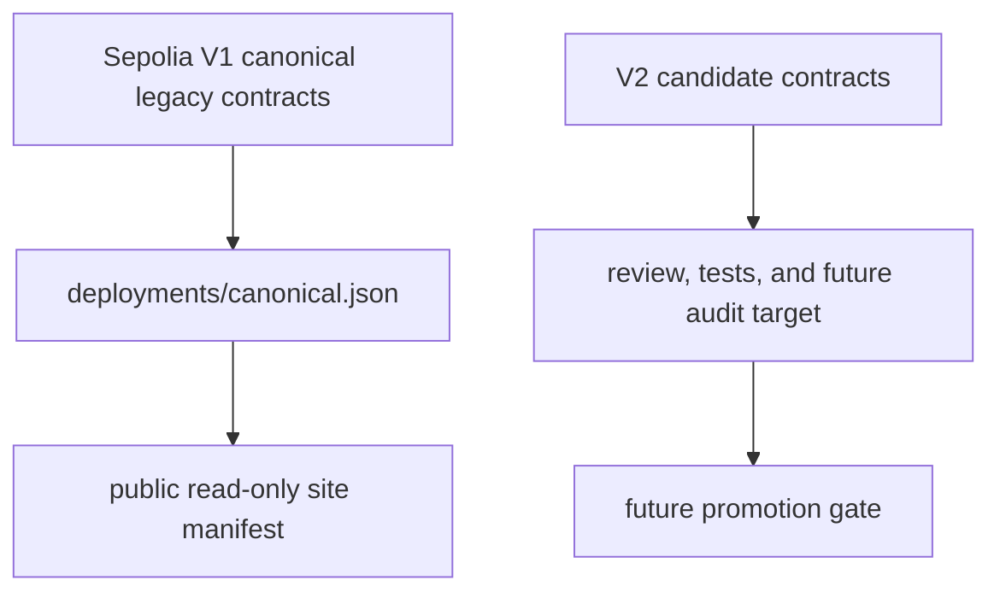

# TikiDeco Architecture

Status: internal review architecture note. V2 is a candidate architecture and is not independently audited.

## Version Model

## Canonical V1 Layer

Sepolia V1 is the historical canonical deployment:

- `TikiDecoToken`: `0xE4c1DE533440b411Be5C17883FF662e95a462097`
- `TikiDecoVestingVault`: `0xc480565482af6B08A3b65D0C9aba985d6240702E`
- Owner Safe: `0xB8Aa322bCF931aE9dD0BD3fE57B03AB71B8A88c3`
- Treasury: `0xf1DAd608ddD5B71F039FEE82026164bc6a245081`

V1 must remain described as historical Sepolia prototype state.

## V2 Candidate Token

`TikiDecoTokenV2` uses OpenZeppelin ERC-20, AccessControlDefaultAdminRules, and Pausable.

Key surfaces:

- fixed supply minted once in constructor to treasury;
- neutral bounded project metadata supplied through constructor configuration;
- delayed two-step default admin transfer;
- `PAUSER_ROLE` gates pause/unpause;
- `REPORTER_ROLE` gates report publication;
- `DEFAULT_ADMIN_ROLE` can administer roles and project URI;
- reports contain bounded category, URI, version, period, hash, and supersede metadata.

## V2 Candidate Vesting Vault

`TikiDecoVestingVaultV2` uses AccessControlDefaultAdminRules, SafeERC20, and ReentrancyGuard.

Key surfaces:

- prefunded vault model;
- schedules reserve already held vault balance;
- delayed two-step default admin transfer;
- `outstandingLiabilities()` tracks reserved minus released;
- releases transfer vested tokens to beneficiaries;
- revocation sends vested amount to beneficiary and unvested amount to treasury;
- treasury transfer is two-step through `pendingTreasury`.

## Public Website And Manifest

The public site is static. It reads `site/deployment-manifest.json`, generated from `deployments/canonical.json`. The dashboard performs read-only Sepolia RPC calls and does not connect wallets or submit transactions.

Custom domain target: `tikideco.xyz`.

## Promotion Gate

V2 promotion requires at minimum:

- explicit canonical manifest update;
- independent audit planning and remediation;
- legal/public communication review;
- deployment runbook sign-off;
- role assignment and treasury confirmation;
- verification links and release notes.
